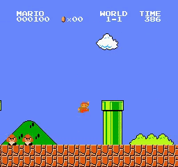

*This repository's purpose is Deep Reinforcement Learning personal practice.*

# Mario-DQN

Deep Q-Learning applied to Super Mario Bros with Keras and Gym.

## Project architecture

- **Config directory :** Projects path constants and AI hyperparameters. 
- **Save directory :** Everything which needs to be saved from execution (model, weights, configuration, results and recording). There is an example of an already trained model with some recordings.
- **Mario DQN directory** with source code split into : 
  - **Agent :** Code relative to the Reinforcement Learning Agent which predicts an Action based on an Environment state.
  - **Environment :** Game environment with different processing layers. 
  - **Runner :** Global project runner with the main loop.
- **Jupyter Notebook :** Notebook with examples.
- **Main :** Main of project, works as a command line tool.

## Examples

See examples on how to train and infer the model in the Jupyter notebook.

## Notes

- If you want to speed up the learning process, run with GPU might help. But be careful : Loading model trained with GPU might affect prediction accuracy.
- It is very probable this code overfits the first level of Mario since the training is done only on the first level without random start. Furthermore, the hyperparameters might need more tuning.
- Known issues / warnings / errors : 
  - *IMPORTANT issue, loading model is defective. Hence, it is impossible to retrieve training performance at the moment.*  
  - Environment name warning : Ignore this warning, it comes from a mismatch between OpenAI Gym and Gym Super Mario Bros. They do not use the "version" parameter for the same purpose.
  - Environment record warning are linked to this open issue in Gym : https://github.com/openai/gym/issues/2905.
  - Saving/Loading model as SavedModel when using class wrapper does not work at the moment. The problem comes from Tensorflow, see here : https://github.com/tensorflow/tensorflow/issues/47554